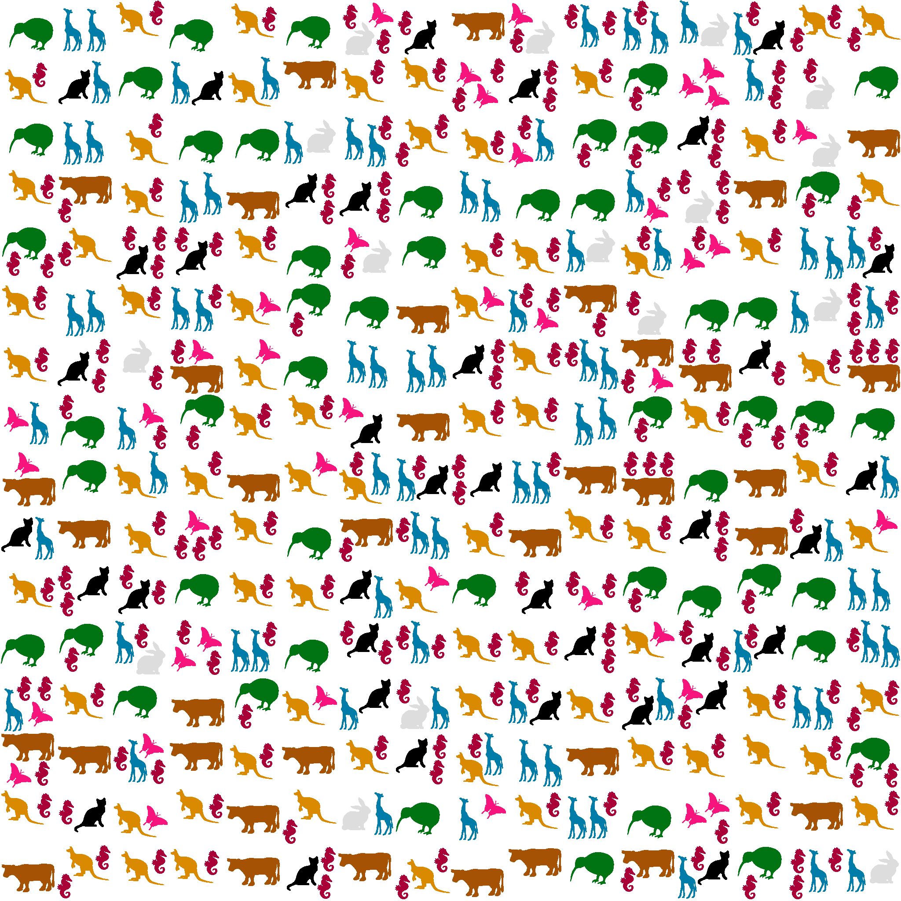

# Concurrent Programming — Multithreaded Image Composer & Linked List

> **Skills:** Java · Multithreading · Synchronized blocks · Volatile · ThreadLocalRandom · Race condition analysis · Lock granularity optimization

---

## Q1 — Parallel Icon Compositor

Randomly places **n icons** onto a 2048×2048 canvas using multiple threads, with no overlapping icons allowed.

### Output



*Icons placed concurrently by 8 threads onto a 2048×2048 canvas*

### Approach
- Canvas split into a **16×16 tile grid** — each tile has its own lock, so threads on different tiles run fully in parallel
- Each worker: picks a random icon → picks a random tile → **atomically** validates position + draws — all within the tile lock
- A shared counter (`COUNT_LOCK`) tracks remaining placements; threads exit when it reaches 0
- `ThreadLocalRandom` used for thread-safe, contention-free random number generation

### Why tile-based locking?
A single global lock would serialize all threads. Fine-grained tile locks allow **true parallelism** — the only contention is when two threads happen to target the same tile simultaneously.

### Usage
```bash
javac q1.java
java q1 -w 2048 -h 2048 -t 8 -n 100
```
| Flag | Description | Default |
|------|-------------|---------|
| `-w` | Output image width | 2048 |
| `-h` | Output image height | 2048 |
| `-t` | Number of threads | 8 |
| `-n` | Number of icons to place | 100 |

### Icons
| | | | |
|---|---|---|---|
|  |  |  |  |
|  |  |  |  |

---

## Q2 — Concurrent Circular Linked List

Three threads operate simultaneously on a **circular linked list** seeded with A → B → C for 5 seconds.

| Thread | Role | Behavior |
|--------|------|----------|
| `worker0` | Reader | Traverses the list, printing each node every 100ms |
| `worker1` | Deleter | 10% chance per step to remove current node (never A/B/C) |
| `worker2` | Inserter | 10% chance per step to insert a random non-ABC node |

### Key Design Decisions
- `Node.next` is **`volatile`** — insertions/deletions are immediately visible across threads without full synchronization
- A/B/C nodes are marked `protectedABC = true` and never deleted — list always has ≥ 3 nodes
- `running` flag is **`volatile`** — main thread's stop signal is seen immediately by all workers

### Intentional Race Conditions (for analysis)
| Race | Scenario |
|------|----------|
| Lost insert | Deleter unlinks a node while inserter is linking into it |
| Lost delete | Inserter sets `current.next` after deleter has already bypassed it |

---

## Files

| File | Description |
|------|-------------|
| `q1.java` | Multithreaded icon compositor |
| `q2.java` | Concurrent circular linked list |
| `icon1–8.png` | Input icons for Q1 |
| `outputimage.png` | Sample render from Q1 |
| `assig1.pdf` | Assignment specification |
